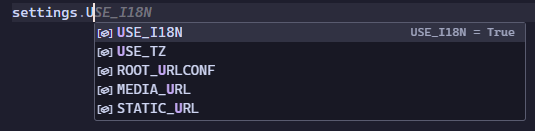
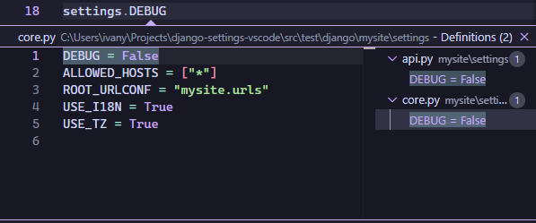
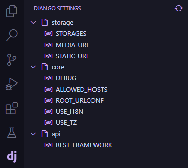

<div align="center">
  <h1>Django Settings for VSCode</h1>
  <a href="https://marketplace.visualstudio.com/items?itemName=IvanArjona.django-settings">
      
  </a>
  <br>
  <br>
  <em>A <a href="https://docs.djangoproject.com/en/dev/topics/settings/">django settings</a> autocompletion extension for Visual Studio Code</em>
  <br>
  <br>
  <a href="https://marketplace.visualstudio.com/items?itemName=IvanArjona.django-settings"></a>
  <a href="https://marketplace.visualstudio.com/items?itemName=IvanArjona.django-settings&ssr=false#review-details"></a>
  <a href="https://github.com/IvanArjona/cloudflare-tunnel-vscode/blob/master/CHANGELOG.md"></a>
</div>

<hr>

<div align="center">
  <h3>Autocompletion</h3>
  
</div>

<div align="center">
  <h3>Jump to definition</h3>
  
</div>

<div align="center">
  <h3>Activity bar</h3>
  
</div>

<br>

## Features

- Autocompletion for Django settings starting with `settings.`.
- Jump to definition for Django settings <kbd>Ctrl</kbd> + <kbd>Click</kbd>.
- View a list of all your Django settings in the activity bar.
- Autorefresh on settings file change.

## Commands

Commands accesible from the Command Palette (<kbd>Ctrl</kbd> + <kbd>Shift</kbd> + <kbd>P</kbd>).

```
Django Settings: Refresh Django Settings
```
